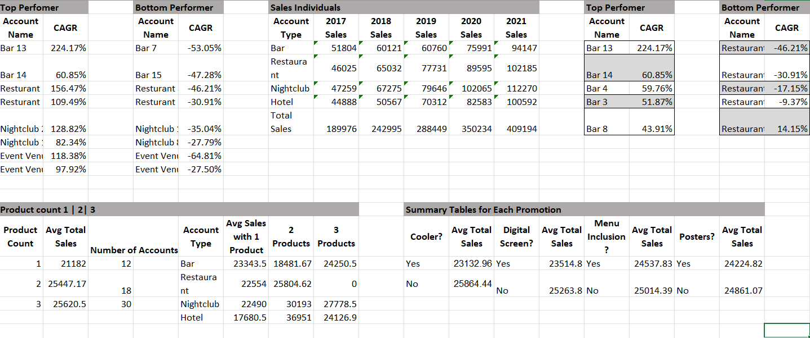
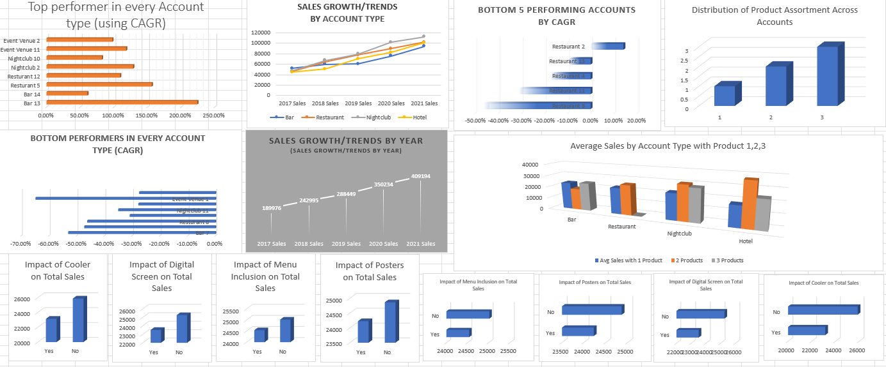
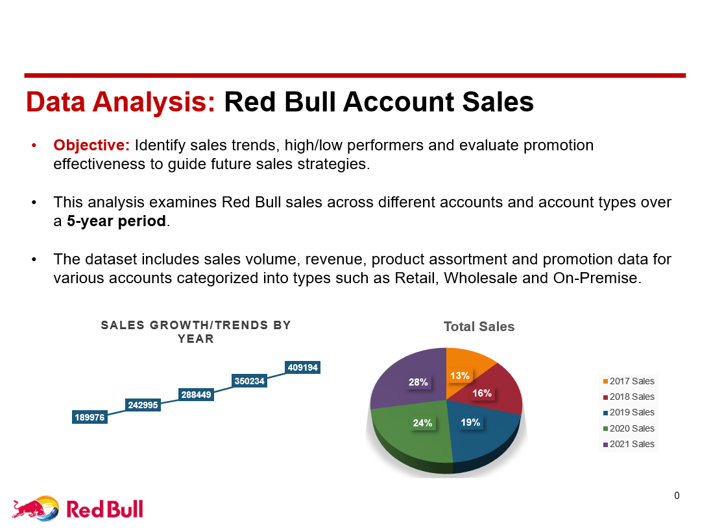
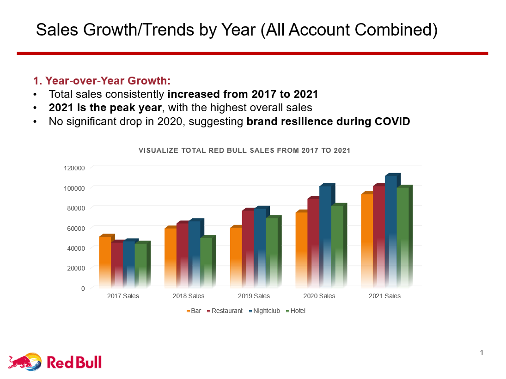
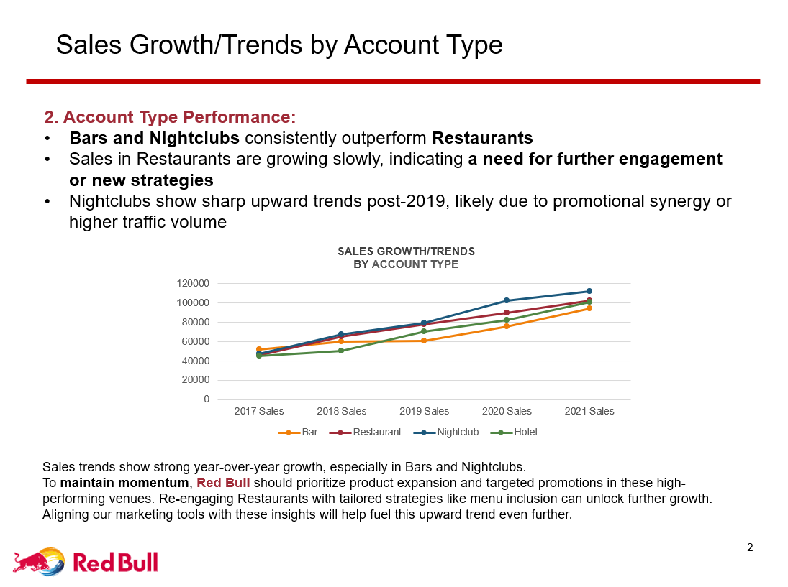
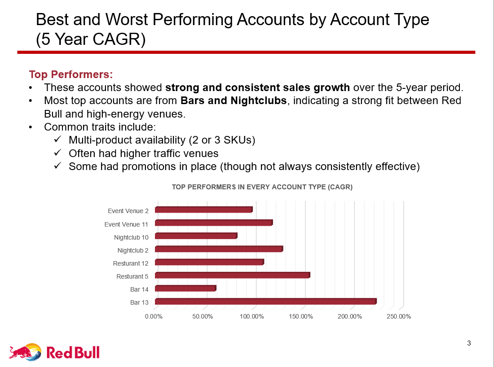
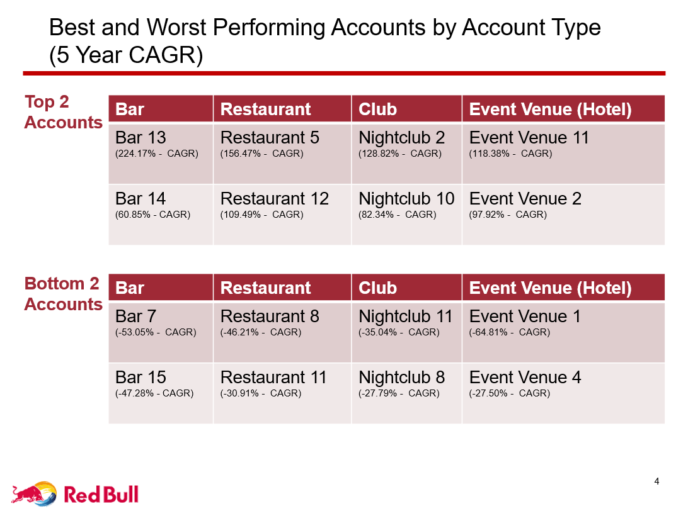
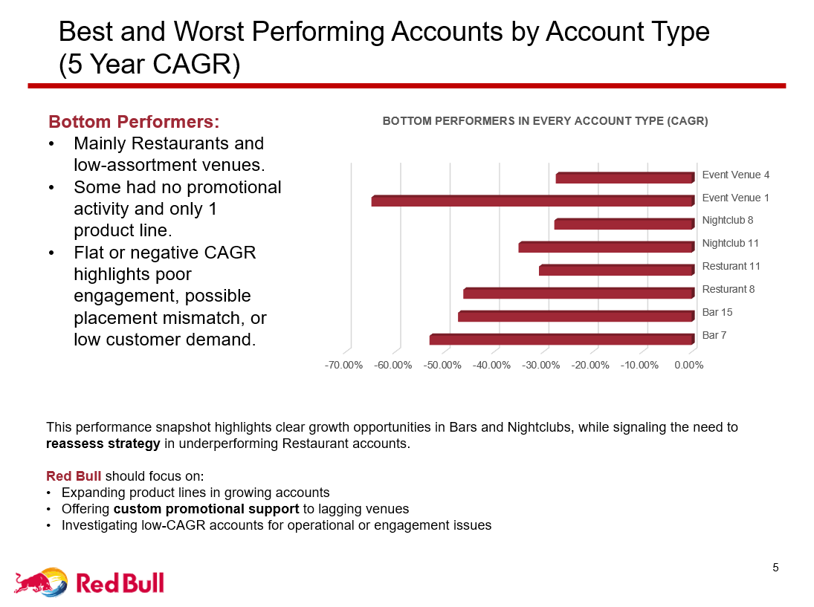
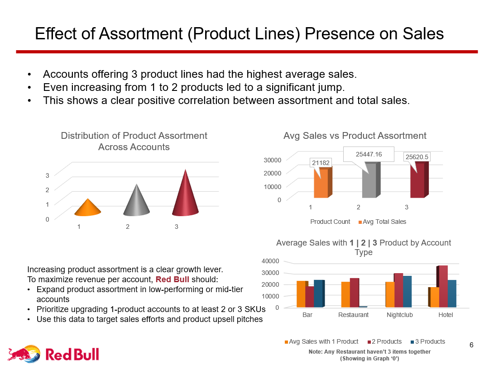

# Project: "On Premise Sales Virtual Aviator Program - Red Bull" 
(This project is based on a real-world job simulation by Red Bull and Forage, where I acted as an On-Premise Sales Specialist to analyze sales data, evaluate marketing impact and handle customer objections using data-driven strategies)

## Domain: Marketing | Sales | Retail and Consumer Behavior | Customer Relationship Management (CRM) & Retention | Business Intelligence & Reporting |  Strategic Decision-Making | Sales Enablement & Communication | Operations | Pricing Strategy

This project is part of my "Master Data Analytics Roadmap" series and represents the second real-world analytics project in my journey. I completed the Red Bull On-Premise Sales Job Simulation via Forage, acting as an On-Premise Sales Specialist. The project demonstrates how data analytics empowers marketing and sales decisions, transforming raw sales data into actionable insights and strategies.
In this post:
* I explore how data analysis is a powerful tool in marketing by calculating CAGR (Compound Annual Growth Rate) and sorting accounts by performance, I learned: Which bars, restaurants or venues were growing or underperforming. Marketers use this to focus efforts on high-potential clients and fix declining ones.
* I analyzed how different marketing tools (coolers, posters, digital screens) impacted sales. Found that accounts using 2+ promotional tools saw 15–20% better performance. Marketers use this insight to decide where to invest budgets—what promotions work best.
* I compared average sales with the number of Red Bull products offered (Regular, Sugar Free, Yellow) and Found that more variety = higher sales. Marketers use this kind of analysis to build product bundling, upselling and menu strategies.
* I didn’t just stop at data—you listened to customer objections (Bar 7 case) and used data + soft skills to reframe objections and pitch solutions. Modern marketing isn't just numbers—it's about understanding people and using insights to guide them.
* I converted raw Excel data into charts, tables and a clear business presentation. Marketers must tell stories with numbers: Why are sales dropping? What’s working? What should we try next?

Marketing isn’t just creative—it’s strategic And strategy needs data. This project proves that data analysts can drive smarter marketing decisions, spot patterns and help brands grow intelligently.

### Task 1: Account Data Analysis
* Total sales by Account Type and Year
* Sales growth/trends by Account Type
* Sales growth/trends by Year
* Best and worst performing accounts (overall, and by account type)
* Effect of assortment (product lines) presence on sales
* Effectiveness of the different marketing/promotion programs

### Task 2: Overcoming Sales Objections
* Made clean datasets like AccountSalesDataforAnalysisv2after.xlxs
* Made Presentation RedBullAccountDataAnalysisBySunilPrajapati.pptx
* Created Graphs and Columns for Analysis

## 📊 Presentation Highlights  

  
  

## Skills Demonstrated
* Data Analytics with Excel – Cleaning, transforming and analyzing structured data
* Business Intelligence & Reporting – Charts, tables, dashboards and storytelling
* Sales & Marketing Strategy – Growth analysis, promotions impact, product assortment insights
* Communication & Objection Handling – Translating analytics into persuasive business arguments
* Domain Knowledge – Marketing, Retail, CRM, Customer Retention, Pricing Strategy

## Project Impact
* Identified high-potential vs. underperforming accounts
* Recommended promotional tool investments with measurable ROI
* Highlighted product bundling/upselling opportunities
* Demonstrated how data analytics supports smarter marketing decisions

## Project Files
|__ Account Sales Data for Analysis v2.xlsx
|__ Account Sales Data for Analysis v2 after.xlsx
|__ Account Data Analysis Template.pptx
|__ Graphs.png
|__ Queries.png
|__ README.md
|__ RedBullAccountDataAnalysisBySunilPrajapati.pptx

